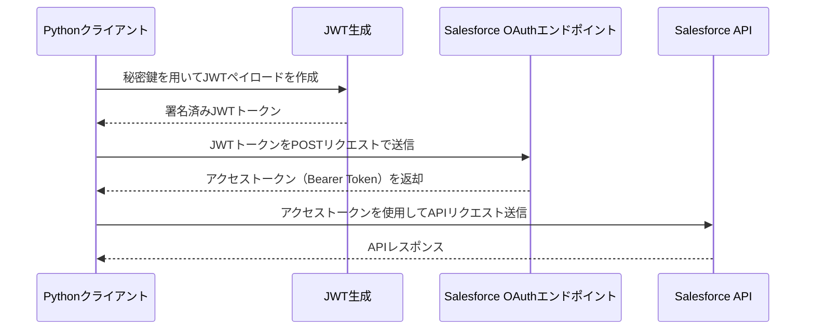

## 自己証明書の作成

```bash
## 1. 秘密鍵の生成（2048 ビット RSA）

openssl genrsa -out salesforce.pem 2048

## 2. 証明書署名要求(CSR)の作成

openssl req -new -key salesforce.pem -out salesforce.csr

## （上記コマンド実行時に組織名やホスト名など幾つか質問されるので適宜入力）

## 3. 自己署名証明書の作成（有効期限 365 日）

openssl x509 -req -days 365 -signkey salesforce.pem -in salesforce.csr -out salesforce.crt

## 4. 不要になった CSR の削除

rm salesforce.csr

```

## python 設定

### 仮想環境の作成

```bash

python3 -m venv venv

. venv/bin/activate

pip install -r requirements.txt

```
